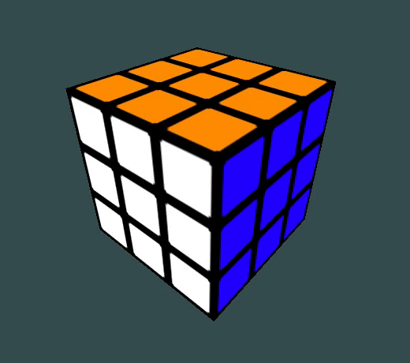

# RubicsCube with OpenGL

A fully playable 3D rubicscube that you can control with your keyboard. 
 

## Controls

**Moving around the cube**: 
- A,D : left and right
- S,W : back and forward
- J,K : bottom and top

**Moving the cube itself** uses the same notation as for real rubicsrube
- F : moves the Forward face clockwise
- R : moves the Right face clockwise
- U : moves the Up face clockwise

To move counter-clockwise, press 'SHIFT'.

## Behind-the-Scene

This project is yet another simple project to learn yet another programming concept: OpenGL.

The model of the rubicscube is in `rubicscube.cpp`. Each of the 26 cube is represented by a `Cube` object, which contains a transform (translation & rotation).

## Roadmap

- Draw the 'selected face'
    - use uniform varable that is set at each little cube
- Be able to select another 'main' face